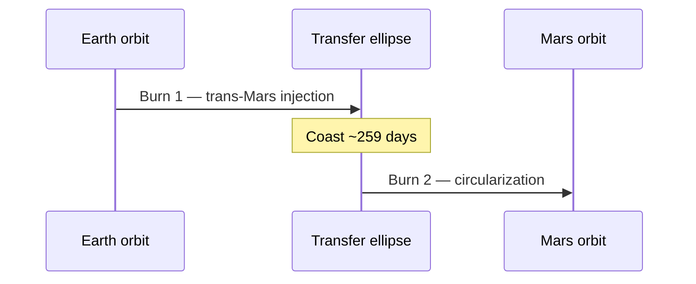

# Hohmann Transfer Orbit

A **Hohmann transfer** is the most fuel-efficient way to move between two
circular orbits, using *two* engine burns. These are working notes for the
Earth-to-Mars window — see the [mission brief](https://example.com/brief) for
the full trajectory.

> [!NOTE]
> All figures assume an idealized two-body model. Atmospheric drag and the
> Oberth effect are handled separately in the `delta-v` budget below.

> [!WARNING]
> The launch window closes in **14 days**. Confirm the C3 figures before sign-off.

## Delta-v budget

| Burn         | Maneuver            | Δv (km/s) | Notes                  |
| :----------- | :------------------ | --------: | :--------------------- |
| 1            | Trans-Mars injection |     3.62 | Prograde, at perigee   |
| 2            | Orbit circularization |    2.08 | At apoapsis            |
| **Total**    |                     | **5.70**  | Excludes margin        |

## The math

The semi-major axis of the transfer ellipse is the mean of the two radii,
$a = \tfrac{1}{2}(r_1 + r_2)$. The first burn changes velocity by:

$$
\Delta v_1 = \sqrt{\frac{\mu}{r_1}}\left(\sqrt{\frac{2 r_2}{r_1 + r_2}} - 1\right)
$$

where $\mu = GM$ is the standard gravitational parameter of the Sun.

## Sequence



## Pre-flight checklist

- [x] Confirm departure window
- [x] Validate Δv budget against margin
- [ ] Final guidance review
- [ ] Range safety sign-off

## Reference

The transfer time is half the period of the ellipse.[^period] For an
Earth-to-Mars transfer that works out to roughly **259 days**.

```python
def transfer_time(a, mu):
    return 0.5 * 2 * pi * sqrt(a**3 / mu)
```

[^period]: Derived from Kepler's third law, $T = 2\pi\sqrt{a^3/\mu}$.
